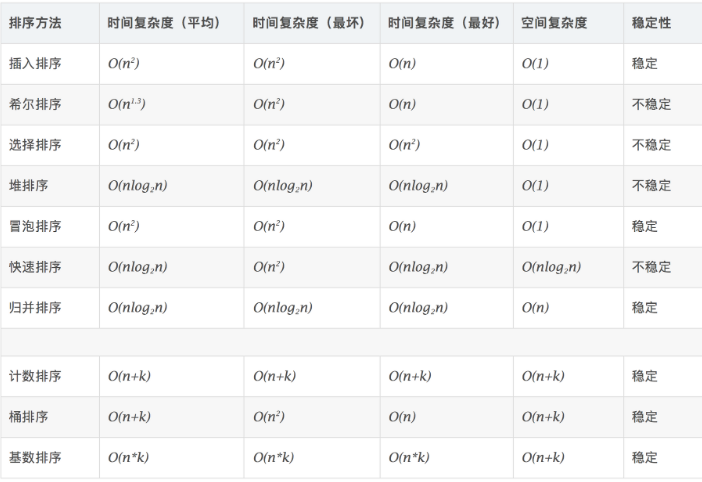
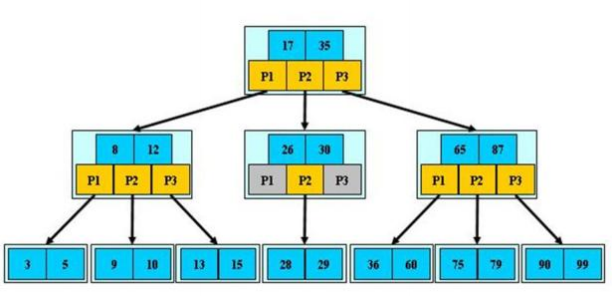
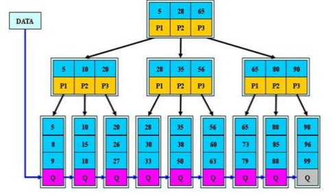
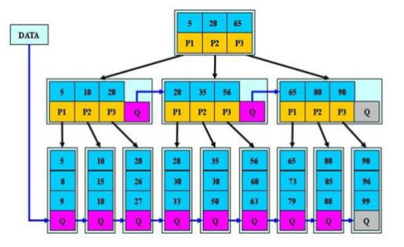

# 算法与数据结构


#### 复杂度

O()

#### 递归复杂度

master公式(递归的子过程规模一致)

$T(N)=a*T(N/b)+O(N^d)$

由问题确定3个参数后，根据下式计算：

+ $log_ba<d  \rightarrow O(N^d)$
+ $log_ba>d  \rightarrow O(N^{log_ba})$
+ $log_ba==d  \rightarrow O(N^d*{logN})$


#### 位运算

+ 与 &

+ 或 |

+ 非 ！

+ 异或  $\wedge$
  + a$\wedge$​a = 0
  + 0$\wedge$a = a

### 排序算法

### $O(N^2)$

#### 1.选择排序

```java

```


#### 2.冒泡排序

```java

```


#### 3.插入排序

```java

```


### $O(NlogN)$

#### 4.归并排序

需要额外的数组空间

是一个二分递归的过程

```java

```

扩展：

小和问题（数组中左边比右边小的和）

逆序对（打印左边比右边大的数对）


#### 5.快速排序

最差时候的时间复杂度是$O(N^2)$,平均时间复杂度是$O(NlogN)$。

但大多数时候要快于其他$O(NlogN)$的算法。

不需要额外的数组，在原始数组上排序，需要额外的变量，也是一个二分递归的过程

荷兰国旗问题

快速排序3.0：

随机选取数组中的某一个值作为中间值，这样时间复杂度为$O(NlogN)$。

```java

```


#### 6.堆排序

只需要有限的变量空间

```java

```


#### 7.桶排序

##### 7.1 计数排序

每个数都由一个数频对应

##### 7.2 基数排序

同位数有十个桶对应


#### 排序汇总




### 栈


### 链表

#### 哈希表

无序

增删改查的时间复杂度为O(1)，为常数时间，但时间比较长

HashSet：有key，无value

HashMap：有key，有value

基础类型（integer string…）为值传递，会将值本身存储在哈希表中

引用类型(对象…)为引用传递，将地址值存储在哈希表中

```java

```


#### 有序表

红黑树、AVL树、size-balance-tree、跳表

TreeSet：有key，无value

TreeMap：有key，有value

基础类型（integer string…）为值传递

引用类型(对象…)为引用传递，必须提供比较器

```java
// O(logN)

TreeMap<Integer, String> treeMap = new TreeMap<>();

//增
treeMap.put(3, "我是3");
treeMap.put(4, "我是4");
treeMap.put(8, "我是8");
treeMap.put(5, "我是5");
treeMap.put(7, "我是7");
treeMap.put(1, "我是1");
treeMap.put(2, "我是2");
//查询是否有key
System.out.println(treeMap.containsKey(1));
//获得key对应value
System.out.println(treeMap.get(4));
//改
treeMap.put(4, "他是4");
System.out.println(treeMap.get(4));
//删
treeMap.remove(4);
System.out.println(treeMap.get(4));//不存在时返回null

System.out.println("新鲜：");
//最小的key
System.out.println(treeMap.firstKey());
//最大的key
System.out.println(treeMap.lastKey());
// <= 4中最大的key
System.out.println(treeMap.floorKey(4));
// >= 4中最小的key
System.out.println(treeMap.ceilingKey(4));
```


#### 单链表


#### 双链表


### 二叉树

#### 递归遍历

递归过程中，每一个结点会经过3次

##### 递归的先序遍历

第1次经过结点的时候打印输出

##### 递归的中序遍历

第2次经过结点的时候打印输出

##### 递归的后序遍历

第3次经过结点的时候打印输出


#### 非递归遍历


##### 宽度优先遍历


#####  搜索二叉树

按照 左头右 的顺序值递增


##### 完全二叉树

只有最后一层结点不满，且结点从左到右是满的。


##### 满二叉树


  

#### 平衡二叉树 Balanced树


#####　２－３树


##### B树

关键字集合分布在整颗树中, 即叶子节点和非叶子节点都存放数据



##### B+树

所有关键字都出现在叶子结点的链表中，非叶子结点不存放数据




##### B*树

B+树的 非根和非叶子结点再增指向兄弟的指针



### 图

邻接表

邻接矩阵

#### 深度优先遍历


#### 广度优先遍历

利用队列


