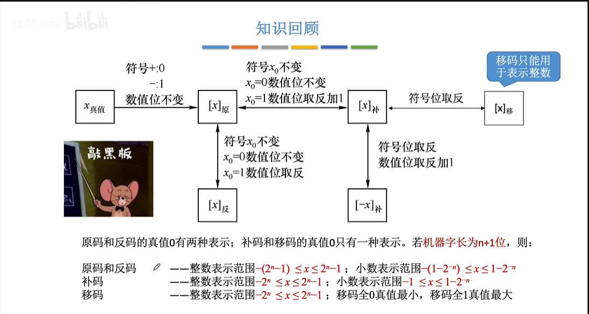

# 第一章 计算机系统概述

## 硬件组成

## 性能指标

# 第二章 数据的表示和运算

## 进位计数

### BCD码

### 字符与字符串

### 奇偶校验码

### 海明校验码

### 循环冗余校验码

## 定点数

### 原码

### 反码

（原码到补码的中间状态）

### 补码

### 移码

补码的符号位取反（只能表示整数）

### 溢出判断

## 浮点数

